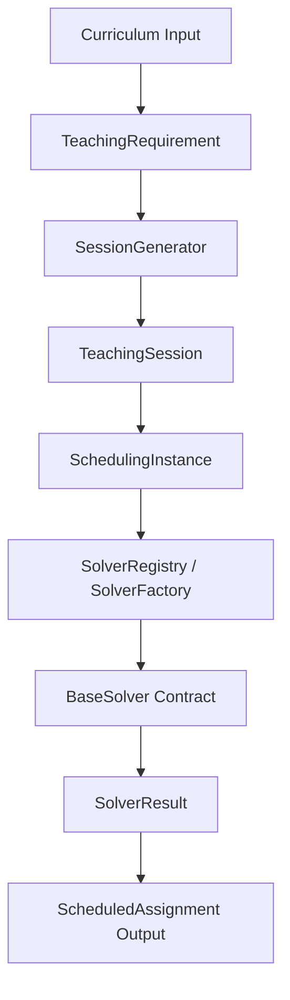

# HanuPlanner Brain: Architectural Refactoring Report

This report summarizes how the core HanuPlanner Brain timetabling engine has been refactored to solve the four major architectural challenges of mixed domain objects, incorrect scheduling units, input proliferation, and solver coupling.

---

## 1. Problem 1: Mixed Domain Objects (SOLVED)

### Challenge
The legacy `Assignment` class served multiple conflicting purposes simultaneously: representing curriculum requirements, solver decision variables, scheduled lectures, and final timetable slots. This caused field collisions because different stages owned different parameters.

### Refactored Solution
We decoupled the scheduling pipeline into distinct, single-responsibility models:
* **`TeachingRequirement`** ([teaching_requirement.py](file:///c:/Users/anubh/Music/ttm%20ai/TTM-AI/brain/models/teaching_requirement.py)): Represents static curriculum planning resource demands (e.g., class hours, faculty credentials, room type preferences) with **zero** scheduling slot fields.
* **`ScheduledAssignment`** ([scheduled_assignment.py](file:///c:/Users/anubh/Music/ttm%20ai/TTM-AI/brain/models/scheduled_assignment.py)): Represents the output scheduled timetabled slot mapping (day, slot ID, room ID, duration, session ID).

---

## 2. Problem 2: Wrong Scheduling Unit (SOLVED)

### Challenge
Solvers do not schedule general subjects (e.g., "DBMS" as a whole). They schedule atomic events (e.g., "DBMS Lecture 1", "DBMS Lecture 2", and "DBMS Lab 1"). Without this separation, variables and constraints become extremely complex.

### Refactored Solution
We introduced the `brain/session/` package:
* **`TeachingSession`** ([session.py](file:///c:/Users/anubh/Music/ttm%20ai/TTM-AI/brain/session/session.py)): Represents the atomic unit of scheduling, holding duration, priority, and dependency parameters.
* **`SessionGenerator`** ([session_generator.py](file:///c:/Users/anubh/Music/ttm%20ai/TTM-AI/brain/session/session_generator.py)): Performs $O(N)$ linear mapping of requirements to sessions:
  * **Theory splitting**: Divides weekly theory hours into discrete slots using a configurable max session duration.
  * **Continuous labs**: Groups weekly lab hours into continuous, multi-hour blocks (e.g. `duration=2`).
  * **Linked dependencies**: Connects lab sessions to require preceding theory session allocations.
  * **Tutorial categorization**: Automatically classifies tutorial session types from constraint references.

---

## 3. Problem 3: Too Many Inputs (SOLVED)

### Challenge
As the engine grew, methods and solvers required longer parameter lists (separate lists for Faculty, Rooms, Subjects, Sections, Slots, Holidays, and Requirements), cluttering function signatures.

### Refactored Solution
We implemented the Parameter Object Pattern:
* **`SchedulingInstance`** ([scheduling_instance.py](file:///c:/Users/anubh/Music/ttm%20ai/TTM-AI/brain/problem/scheduling_instance.py)): An immutable, hashable, thread-safe value object encapsulating all timetabling domain datasets, holidays, configurations, and constraint sets.
* **`SchedulingInstanceBuilder`** ([instance_builder.py](file:///c:/Users/anubh/Music/ttm%20ai/TTM-AI/brain/problem/instance_builder.py)): A fluent builder utilizing `InstanceValidator` ([instance_validator.py](file:///c:/Users/anubh/Music/ttm%20ai/TTM-AI/brain/problem/instance_validator.py)) to enforce referential integrity across IDs prior to assembly.

---

## 4. Problem 4: Solver Coupling (SOLVED)

### Challenge
Solvers depending directly on domain models make comparing or replacing solvers difficult. The domain should know nothing about specific solver algorithms.

### Refactored Solution
We established standard contracts:
* **`BaseSolver`** ([base_solver.py](file:///c:/Users/anubh/Music/ttm%20ai/TTM-AI/brain/solver/base_solver.py)): Abstract Base Class detailing solver behavior interfaces (`solve()`, `supports()`, `metadata()`, `statistics()`).
* **`SolverResult`** ([solver_result.py](file:///c:/Users/anubh/Music/ttm%20ai/TTM-AI/brain/solver/solver_result.py)): A standardized result container holding status (`SolverStatus` StrEnum), scheduled assignments, statistics, diagnostics, runtime, and objective value.
* **`SolverRegistry`** ([solver_registry.py](file:///c:/Users/anubh/Music/ttm%20ai/TTM-AI/brain/solver/solver_registry.py)) and **`SolverFactory`** ([solver_factory.py](file:///c:/Users/anubh/Music/ttm%20ai/TTM-AI/brain/solver/solver_factory.py)): Catalog and instantiate solvers dynamically by name key.

---

## 5. Timetabling Pipeline Architecture

---

## 6. Verification Metrics

All refactored components are verified under strict engineering standards:
1. **Pytest Suite**: All **216 test cases passed successfully** (including mock solver contract validations and scheduling instances integrity validations).
2. **Code Coverage**: **99% total coverage** across the active engine codebase (100% statement coverage achieved in the new `session/`, `problem/`, and `solver/` contract modules).
3. **Type Checking (mypy)**: Passed strictly on all 68 source files with zero errors.
4. **Linter & Formatting (ruff)**: Fully compliant.
