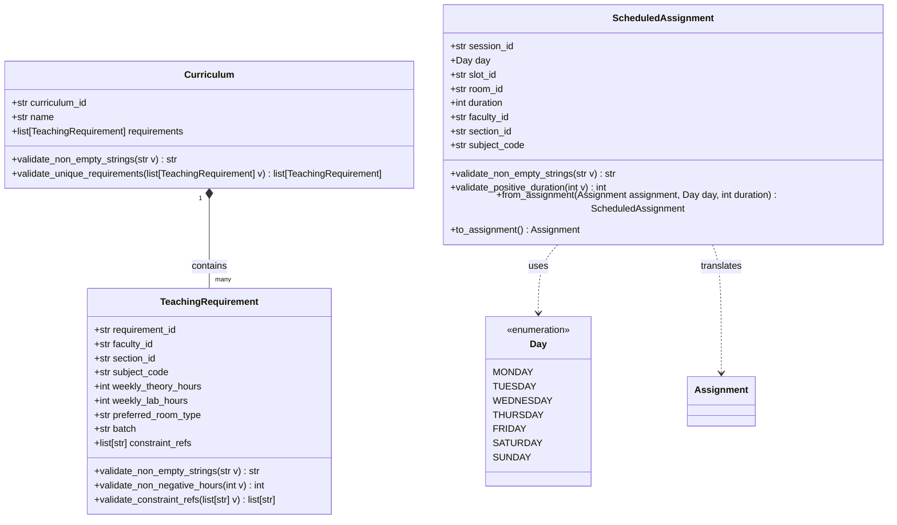

# Domain Refactor: Curriculum Planning vs. Scheduled Assignments

To decouple curriculum planning from scheduled lecture slots, we have introduced a cleaner separation of concerns using three new models: `Curriculum`, `TeachingRequirement`, and `ScheduledAssignment`.

---

## 1. UML Class Diagram



---

## 2. Migration Guide

### Why Refactor?
Previously, the `Assignment` model forced all variables (day, slot, room, faculty, section) into a single entity. This conflated *demand planning* (who needs to teach what to whom for how many hours) with the *scheduling decision* (placing that session at a specific day, slot, and room). 

By separating them:
1. **`TeachingRequirement`** represents pure, static constraints/demands loaded from the syllabus. It contains no schedule details (`day`, `slot`, `room`).
2. **`ScheduledAssignment`** represents the dynamic, solved status where duration, day, slot, and room are bound.

### Model Comparison

| Old Model Field (`Assignment`) | Planning Model (`TeachingRequirement`) | Schedule Model (`ScheduledAssignment`) |
|---|---|---|
| `assignment_id` | `requirement_id` (Curriculum unique ID) | `session_id` (Unique scheduled session ID) |
| `faculty_id` | `faculty_id` | `faculty_id` |
| `section_id` | `section_id` | `section_id` |
| `subject_code` | `subject_code` | `subject_code` |
| `slot_id` | *(N/A - dynamically assigned)* | `slot_id` |
| `room_id` | *(N/A - dynamically assigned)* | `room_id` |
| *(N/A)* | `weekly_theory_hours` | *(N/A)* |
| *(N/A)* | `weekly_lab_hours` | *(N/A)* |
| *(N/A)* | `preferred_room_type` | *(N/A)* |
| *(N/A)* | `batch` | *(N/A)* |
| *(N/A)* | `constraint_refs` | *(N/A)* |
| *(N/A)* | *(N/A)* | `day` (Day enum) |
| *(N/A)* | *(N/A)* | `duration` (integer) |

---

## 3. Migration Utilities

To ensure backward compatibility, the `ScheduledAssignment` model provides explicit class/instance methods for migrating to and from the older `Assignment` layout:

### From `Assignment` to `ScheduledAssignment`
```python
from brain.models import Assignment, Day, ScheduledAssignment

old_assignment = Assignment(
    assignment_id="A1",
    section_id="SEC_A",
    faculty_id="F1",
    subject_code="CS101",
    slot_id="S1",
    room_id="R1"
)

# Convert using the utility
scheduled = ScheduledAssignment.from_assignment(
    assignment=old_assignment,
    day=Day.MONDAY,
    duration=2
)

assert scheduled.session_id == "A1"
assert scheduled.day == Day.MONDAY
assert scheduled.duration == 2
```

### From `ScheduledAssignment` to `Assignment` (Backward Compatibility)
```python
from brain.models import ScheduledAssignment, Day

scheduled = ScheduledAssignment(
    session_id="S101",
    day=Day.TUESDAY,
    slot_id="SL_02",
    room_id="ROOM_302",
    duration=1,
    faculty_id="F10",
    section_id="SEC_B",
    subject_code="CS202"
)

# Export to old layout
old_layout = scheduled.to_assignment()

assert old_layout.assignment_id == "S101"
assert old_layout.slot_id == "SL_02"
assert old_layout.room_id == "ROOM_302"
```
